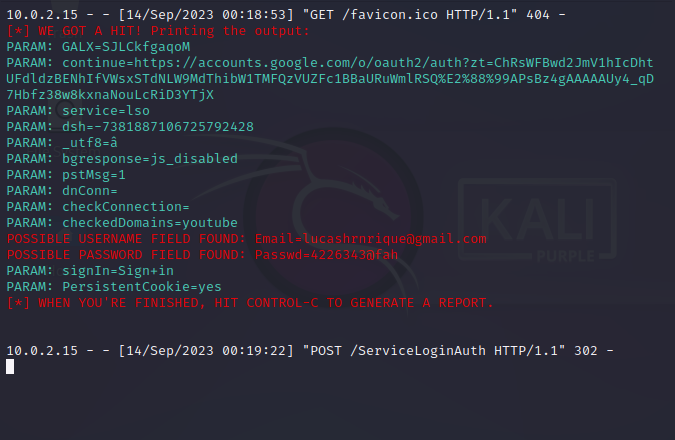

# Fazendo Phising com o Setookit
- Digite o seguinte comnado para ter acesso root: [sudo su]

- Digite a senha 

- Depois você pegara o ip da sua maquina ( pode ser privado ou publico ): [ifconfig]

- Inicialize a ferramenta com o seguinte comando: [setookit]

- Em seguida abrirar um menu  com diversas opções dentre um delas você ira selecionar a opção [Social-Engineering Attacks]

- Depois de selcionado a opção você escolher o [Website Attack Vectors]

- Ultilize o metodo de ataque: [ Credential Harvester Attack Method ]

- Em diante aparecerar três opçõs:
  1) Web Templates (Tamplates de sites ja clonado)
  2) Site Clone (Você irar selecionar a site na qual você queira clonar)
  3) Custom Import
  99) Return to Webattack Menu (Voltar ao menu)
- No meu caso um particular eu esculhi o [ 1) Web Templates ]

- Em seguida ele ira pedir o ip na qual você queira hospedar o servidor 

- Depois aparecerar os três templates principais:
- 1) Java Required
  2) Google
  3) Twiter 
- Pronto agora e so se conectar em qualquer browser através do ip publico ou privado selecionado acima
- Quando a Vítima reponder aos inputs do formulairo a tudo que estiver colocado no input automaticamnente este sera enviado para você como o exemplo abaixo:

